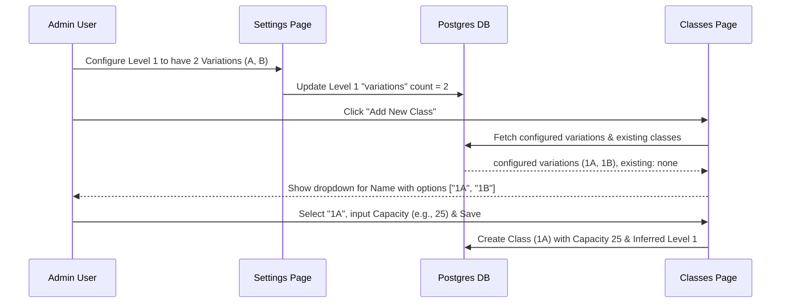
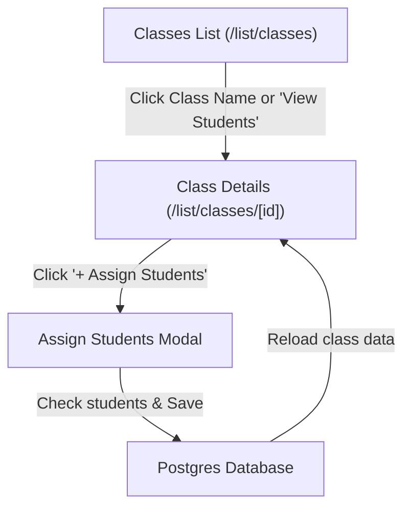

# FEATURE_LOG.md — SnapSchool Feature and Logic Documentation
> Last updated: 2026-05-27

This file tracks all custom features, schema changes, and custom business logic implemented in the SnapSchool codebase. **Review this file before making any changes to the database, actions, or entity forms.**

---

## 1. Decentralized Class Creation Flow (Option A)

### Context & Problem Statement
Previously, configuring "Variations (A-Z)" (e.g., A, B, C) in **Settings -> Academic Structure** would automatically populate and save `Class` records (like "1A", "1B") directly into the database with a default capacity of 30. This made the "Add Class" form on the Classes list page redundant, as classes were already created automatically.

### New Logic Flow
We shifted to a two-step decentralized structure:
1. **Settings defines the allowed structure:** Settings now only stores the *number* of variations configured per level (e.g., Level 1 has 2 variations). It does **not** auto-create the classes.
2. **Classes page handles instance creation:** The "Add Class" form actually creates the class instance, populated from the allowed variations not yet created.

### Affected Components & Logic Details

#### A. Database Schema (`prisma/schema.prisma`)
- Added `variations Int @default(0)` to the `Level` model.
- Kept `Class` as a relational child of `Level`.

#### B. Actions (`src/app/(dashboard)/admin/actions/schoolActions.ts`)
- **`syncLevelVariations(levelId, count)`**: Now simply updates the `Level` record's `variations` column with the new count. 
- **Graceful Cleanup**: If the variation count is *reduced* in Settings (e.g., 3 -> 2), it checks if there are empty `Class` records exceeding the new count (e.g., "1C" exists but count is now 2) and deletes them. If a class is not empty (contains students/lessons/timetable), it returns a list of errors without deleting them.

#### C. Classes Page (`src/app/(dashboard)/list/classes/page.tsx`)
- Fetches all configuring `Level` structures, including their variations and currently created subclasses.
- Dynamically computes the list of **available (uncreated)** class names (e.g., if variations count is 3 and only "1A" exists, it offers "1B" and "1C" in the options).
- Passes the options list to the modal form.

#### D. Form Modal (`src/components/CrudFormModal.tsx`)
- **Simplified Class Form**: Updated `entityFields.class` to contain:
  1. `name` (Class Name) - Now a `select` dropdown instead of a text input.
  2. `capacity` (Capacity) - `number` input.
  - **Removed `gradeId` (Grade) and `supervisorId` (Supervisor)** to simplify creation and let teachers/supervisors be assigned dynamically elsewhere.
- **Update Mode Option Retention**: In update mode, the form automatically injects the class's current name into the dropdown options, ensuring it displays and saves properly.

#### E. Class Actions (`src/lib/crudActions.ts`)
- **Level Invalidation & Auto-inference**: Since Grade/Level was removed from the form, the `createClass` and `updateClass` actions automatically parse the level number from the selected name (e.g. `data.name.match(/^\d+/)` parses "1A" -> Level 1). It queries the database for the corresponding `Level` ID under the active `schoolId` and links it automatically.

## 2. Dynamic Class Details & High-Fidelity Student Directory

### New Logic Flow
To align with the high-fidelity school management mockup provided by the user, we implemented a dedicated **Class Details & Student Directory** view:
1. **Interactive Class Linkages:** In the **Classes** page (`/list/classes`), clicking the class name or the dedicated **`View Students`** button redirects the administrator to `/list/classes/[id]`.
2. **Mockup-Inspired Student Registry:** The new dynamic Class Details page displays:
   - Level, capacity limits, and class supervisor summaries.
   - A table listing **all students enrolled in this class** showing their profile avatar, full name, username, roll number, address, DOB, and actions.
   - Clean dynamic roll number formatting (e.g. `#01`, `#02`...) matching the mockup.
3. **Contextual Class-Student Assignments:** An **`+ Assign Students`** action button is positioned at the top right of the table. Clicking it opens a searchable modal to bulk select other students in the school using checkboxes and assign them to this class.

### Affected Components & Logic Details

#### A. Classes List Component (`src/app/(dashboard)/list/classes/page.tsx`)
- Simplified query load: removed parent and student fetches from the server component to optimize page load speeds.
- Links rows directly to `/list/classes/${item.id}` and adds the purple `View Students` action button.

#### B. Dynamic Class Details Component (`src/app/(dashboard)/list/classes/[id]/page.tsx`)
- Fetches active class details and its enrolled students.
- Fetches all other unassigned/assignable students in the school to construct options for bulk checkbox selection.
- Builds a premium responsive table matching the design mockup layout.

---

## 3. AI Timetable Scheduler Playground Visual Overhaul & Redundancy Removal

### Context & Problem Statement
The AI Scheduler Playground is dedicated to generating, viewing, and planning curriculum draft timetables before they are approved and published. However, two significant UX limitations cluttered this workspace:
1. **Redundant Actions & Switchers:** The presence of the Active vs. Draft Suggestion toggle switcher on this playground page was redundant (since active schedules belong strictly to the main Timetable page) and crowded the premium top workspace bar.
2. **Cramped Inline Cell Editing:** In manual editing mode (`isEditMode={true}`), clicking "Add Session" or editing a slot squeezed three thick select inputs and multiple buttons inline inside the tiny `min-h-[140px]` table grid cell. This caused massive visual breakage, pushed columns out of alignment, and resulted in a cramped, ugly UI.

### Improvements Implemented
1. **Redundancy Clean-Up:** Completely removed the Active vs. Draft Suggestion toggle switcher from the top bar when the page is rendered in draft mode (`forceDraft={true}`). This guarantees that the playground workspace is clean and focuses exclusively on curriculum draft optimization.
2. **Done Editing Navigation Flow:** Toggled button states dynamically so that when manual editing is active, irrelevant background actions (e.g. AI Magic Generate, Download PDF) are hidden, replacing them with a single clean, prominent **Done Editing** green action check to prevent flex-wrapping overflow clutter.
3. **High-Fidelity Fixed Dialog Modals for Editing slots:**
   - **Full Viewport Overlay Dialog:** Completely replaced the cramped inline editing card in `ScheduleSlot.tsx` with a premium, sleek modal overlay utilizing a frosted-glass background backdrop blur (`backdrop-blur-md bg-slate-900/40`) and soft scale transitions.
   - **Roomy Form Layouts:** Built spacious, elegant field controls inside the modal container. Embedded decorative status icons (`BookOpen`, `User`, `MapPin`) next to selects with polished slate border outlines and custom drop shadows.
   - **Refined Action Actions:** Provided spacious action buttons including a red trash can delete option, a neutral Cancel, and a primary purple checkmark **Save Session** button, keeping cells perfectly aligned in the main grid sheet.
4. **Fusing Containers into a Unified Main Header Card:** Merged the separate yellow draft review alert banner card directly inside the bottom of the main white header block, forming a single, visually integrated controller with beautiful shared padding and unified shadow contours.
5. **Transfer to Database & Menu Integration:**
   - **Publish to Active Button:** Added a primary green `Publish to Active` button directly to the top bar when a draft is active on the AI Scheduler page. Clicking this triggers the database transaction (`publishDraftTimetable`) to clone draft slots into official active records.
   - **Automatic Redirection:** Updated the action completion callback to automatically route the administrator via Next.js router (`router.push`) to the official **Academic Timetable** page (`/admin/timetable?classId=...`) and trigger `router.refresh()`. This seamlessly transfers the draft to the database and shifts the active view to the official Menu calendar page.
   - **Discard Draft Action:** Added a dedicated `Discard Draft` button next to publish, allowing users to permanently wipe the draft and instantly reset the playground state.
6. **Visual Enhancements & Premium Styling:**
   - **Dynamic Gradient Icon:** Replaced the generic clock icon with a vibrant gradient icon utilizing the `Sparkles` icon (`bg-gradient-to-tr from-indigo-500 via-purple-500 to-pink-500 text-white`) when in AI mode.
   - **Clean Pill Badges:** Restructured the header pills, introducing a sleek purple `"AI Scheduler"` status badge to complement the `"View Mode" / "Edit Mode"` state pill.
   - **Micro-Interactions & Hover States:** Upgraded action buttons (`Download PDF`, `AI Magic Generate`, `Edit Schedule`) with subtle hover scaling (`hover:scale-[1.02] active:scale-[0.98]`) and enhanced shadow structures for a premium SaaS look.
   - **Form Select Styling:** Upgraded the class selector dropdown container and select input with polished light grey borders (`border-slate-200`) and standard typography matching the premium dashboard layout.

---

## 4. Arabic-Only Subject Name Formatting for Timetable & AI Scheduler

### Context & Problem Statement
Subject records in the database store trilingual name labels separated by pipes (e.g. `الرياضيات | MATHÉMATIQUES | MATHEMATICS`). While highly detailed, displaying the full trilingual string inside the dense layout of the timetable calendar cells and selection modals led to a cluttered and messy UI presentation.

### Improvements Implemented
1. **Dynamic Text Splitting:** Integrated dynamic string-splitting logic into the subject rendering elements. The string is split by the pipe (`|`) character, and only the first segment (which represents the **Arabic translation**) is kept and trimmed: `rawSubjectName.split("|")[0].trim()`.
2. **Timetable Calendar Grid Cells:** Implemented formatting in the `ScheduleSlot` component, ensuring the active calendar displays clean Arabic names (e.g., `الرياضيات` instead of `الرياضيات | MATHÉMATIQUES | MATHEMATICS`).
3. **Interactive Select Dropdowns:** Applied the same Arabic formatter to the subject select lists inside the scheduler edit popup forms, making draft modification highly polished.
4. **AI Generation Proposal Cards:** Integrated formatting inside the `AiScheduleModal` review steps so generated schedules are previewed using only clean Arabic subject titles.

---

## 5. Dashboard Unpaid Employees & Multi-Tenancy Payment Isolation Fix

### Context & Problem Statement
The Admin Dashboard's Action Center was displaying `$0` unpaid employees and `0 Pending` records, despite there being multiple active teachers and staff with no `PAID` salary records in the current month. The cause was that the unpaid employee query fetched records solely from the `Payment` table matching `PENDING/PARTIAL` statuses. It did not handle teachers or staff who had no payment record yet generated for the current month, nor did it enforce multi-tenancy `schoolId` filters, posing a risk of cross-school data leakage.

### Improvements Implemented
1. **Teacher & Staff Left Join Queries:** Rewrote `getUncollectedData` inside `DashboardAppendage.tsx` to execute high-fidelity raw SQL `LEFT JOIN` queries for both teachers and staff:
   - Queries all active `Teacher` and `Staff` profiles under the active `schoolId`.
   - Performs a `LEFT JOIN` on the `Payment` table filtered by the current `month` and `year`.
   - Filters rows where `pay.status IS NULL OR pay.status != 'PAID'`, identifying any personnel with missing or incomplete salary payouts.
2. **True Database Metrics Representation:** Correctly mapped the resulting query rows, calculating proper deferred/due amounts and aggregating them to present the real unpaid employee balance and lists.
3. **Multi-Tenancy Payment Isolation:** Hardened the student uncollected fee query by enforcing `s.schoolId = ${schoolId}` as a hard constraint, aligning it with multi-tenant data partitioning rules.

---

## 6. AI Scheduler Portal (Timetables & Exams) Workspace Selection & Draft Publishing

### Context & Problem Statement
Previously, the AI Scheduler was only capable of drafting and generating academic lesson timetables. There was no support for drafting and generating examination schedules cleanly using separate draft and active database models, nor was there a selection entry point. If administrators wanted to schedule exams, they had to modify the active exam schedule directly with zero draft sandbox testing, making it high-risk.

### Improvements Implemented
1. **Selection Portal Landing Page:** Redesigned the `/admin/timetable/ai` page routing to serve as a stunning, high-fidelity **AI Scheduler Playground Portal** selection landing page.
   - Built two large choice cards styled with custom gradients, premium decorative badges, sparkles, and arrow micro-interactions.
   - Allows administrators to seamlessly choose between entering the **Weekly Timetables Playground** (`type=timetable`) or the **Exam Calendars Playground** (`type=exam`).
2. **Database Draft Status for Exams:** Extended the database layer by adding `isDraft Boolean @default(false)` directly to the `Exam` model in `prisma/schema.prisma`. Verified and pushed schema sync to the active PostgreSQL database.
3. **Draft-Aware Exam Server Actions (`examActions.ts`):**
   - Added draft parameter support to `getExamsByClass`, `updateExamSlot`, and `bulkUpdateExams`.
   - **`publishDraftExams(classId, period)`**: Implemented transactional query logic that drops the active exams schedule for the class/period, clones the drafts into active status (`isDraft: false`), and automatically clears the drafts.
   - **`discardDraftExams(classId, period)`**: Implemented transactional logic to wipe out all suggested exam draft rows cleanly.
4. **Interactive Exam Client Playground (`ExamTimetableClient.tsx`):**
   - Automatically saves AI generations into draft status when accessed inside the playground, guaranteeing sandbox safety.
   - **Direct Header Actions & Premium Capsule Groups:** Replaced the unorganized single line of actions with grouped pill capsule containers (`bg-slate-50 border border-slate-200/50 rounded-2xl p-1 gap-1`) for both weekly timetables and exams.
     - **Capsule 1 (Design):** Combines `Edit Schedule` and `AI Generate` / `Regenerate` together as curriculum drafting actions.
     - **Capsule 2 (Approval):** Combines `Publish` and `Discard` together as draft review actions.
     - **Capsule 3 (Export):** Standalone outline icon button for `PDF` downloads.
   - **Compact Layout Integration:** Shortened action labels ("Approve & Publish" to "Publish", "Discard Suggestion" to "Discard", "AI Magic Generate" to "AI Generate", and "Download PDF" to "PDF") and refined padding configurations to ensure **all action controls fit beautifully on a single row** without any wrapping clutter.
   - **Visual Hierarchy & Intentional Badging:** Cleaned up the floating mode badges (`View Mode`, `AI Scheduler`), merging them into a single, cohesive, light-grey inline metadata dot status pill on a single line. This prevents text competition and gives the bold, uppercase title complete breathing room.
   - **Richer Identity Icon Card:** Redesigned the default icon boxes into rich, dual-tone card capsules (`bg-gradient-to-br from-indigo-500/10 via-purple-500/10 border border-indigo-100/80 rounded-3xl`) with glowing border gradients and micro-scale effects for a state-of-the-art SaaS look.
   - **Connected Status Context Selectors:** Repositioned the disconnected Class Selector dropdown from the title level to a cohesive **Target Scope Metadata Bar** directly below the main title, displaying the class select pill and the Week Period context together. This establishes a clear target scope for the playground while keeping the main title area incredibly polished and minimal.
   - **Complete Banner Removal:** Completely removed the redundant yellow draft review alert banner, eliminating clutter and creating a clean, minimal, and premium layout matching modern SaaS design systems.
   - **Real-Time State Synchronization Fix:** Upgraded `onRefresh` to increment `refreshKey` instead of directly firing `fetchSlots`. This successfully triggers all linked react state hooks and correctly recalculates/displays the draft review elements immediately when slots are manually created, moved, or deleted.
   - **Decoupled AI Features from Official Registry Pages:** To centralize all AI schedule drafting and generation inside the sandbox **AI Scheduler Playground Portal** (`/admin/timetable/ai`), we conditionally removed the `AI Generate` button and its slate grouping capsule from both the official **Academic Exams** registry page (`/list/exams`) and the official **Academic Timetable** page (`/admin/timetable`). When loaded in standard view mode (`forceDraft={false}`), these pages now display a gorgeous, standalone outline `Edit Schedule` button instead of the design capsule, keeping production calendars pristine and strictly dedicated to manual edits and exports.

---

## 7. Guidelines for Future Database or Logic Modifications
- **Never auto-create class records outside of this flow.** All class creation must run through `createClass` inside `crudActions.ts` to ensure consistent auto-level-mapping.
- **If changing student enrollment logic:** Student creation retains `classId` assignment. Linking a student to `classId` automatically maps them to that class.
- **Draft Status Constraints:** When querying or bulk writing timetables or exams under AI Scheduler routes, always pass `isDraft: true` to prevent active database pollution.
- **Separation of Production vs. Sandbox Playgrounds:** Always enforce `forceDraft` separation. Keep AI generating and draft publishing actions restricted to `forceDraft={true}` scopes.

---

## 8. Grades Section Fix — Fake Student Cleanup & Arabic Subject Names

### Context & Problem Statement
The `/admin/grades` page had two critical data integrity issues:
1. **100 fake mock students** (IDs `student1`–`student100`, names `StudentNameN StudentSurnameN`) existed in the `rayens-school` tenant database as leftover seeding artifacts. They were cluttering the grades page sidebar with fake data.
2. **Trilingual subject names** stored as `الرياضيات | Mathématiques | Mathematics` were being displayed verbatim in the grades entry form and report card. The old code used a **hardcoded static translation map** (`subjectTranslations`) that guessed English names independently of the actual DB subjects — completely unreliable for any school that uses different subject names.
3. **Hardcoded domain structure** in `report-card/route.ts` used fixed English subject lists (e.g., `["Arabic Communication", "Reading", "Writing", "Grammar"]`) to calculate domain averages. This broke for schools with non-English subject names.

### Improvements Implemented

#### A. DB Cleanup
- Deleted all 21 `Grade` records attached to mock students.
- Deleted all 109 `Notification` records and 9 `Result` records attached to mock students.
- Deleted all 100 mock `Student` records from the database permanently.

#### B. Arabic-Only Subject Name Display (`GradeEntryForm.tsx`)
- Removed the static `subjectTranslations` map (random guessing, not from DB).
- Added `parseArabicName(name: string): string` helper that splits by `|` and returns the first segment trimmed.
- Applied `parseArabicName()` to all subject name displays in the grade entry grid.
- Added `dir="rtl"` to subject name labels for correct RTL text rendering.

#### C. Dynamic Domain-Based Report Card (`report-card/route.ts`)
- Completely rewrote domain average calculation to be **fully dynamic from DB subjects**.
- Groups all subjects by their `domain` field from the DB.
- Calculates domain average = average score of all subjects in that domain.
- Calculates general average = simple average of all domain averages.
- Eliminated all hardcoded English subject name lists.

#### D. Arabic Subject Names in Report Card (`ReportCardClient.tsx`)
- Added `parseArabicName()` helper to the client.
- Removed the hardcoded `domainLabelMap` dictionary that translated English domain names to Arabic.
- Domain header now uses the DB `domain` value directly.
- Subject rows now display Arabic-parsed names with `dir="rtl"`.
- Simplified row rendering by removing special-cased French sub-header/sub-total grouping logic.

### Affected Files
- `src/app/(dashboard)/admin/grades/GradeEntryForm.tsx`
- `src/app/(dashboard)/admin/grades/[studentId]/report-card/ReportCardClient.tsx`
- `src/app/api/report-card/route.ts`
- DB: Deleted 100 mock students and associated records from `rayens-school`

### Guidelines
- **Never hardcode subject names in UI or API.** Always query subjects from the DB and use `parseArabicName()` for display.
- **Subject names must follow the `Arabic | French | English` pipe format** if trilingual. Single-language names work as-is.
- **Domain grouping** is determined by the `domain` field on the `Subject` model, not by hardcoded arrays.
