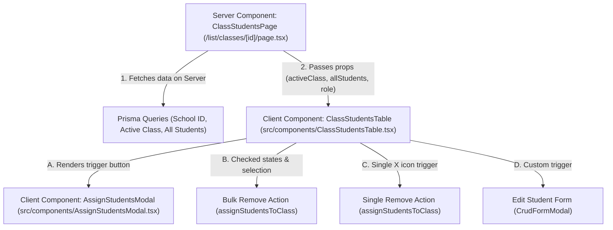

# High-Fidelity Student Directory & Bulk Enrollment Management

> **Last Updated:** 2026-05-27
> **Author:** Antigravity AI
> **Focus:** Classes & Students Directory Alignment, Bulk Actions, Multi-Selection, and Real-Time Search.

This note documents the design decisions, component architecture, database transactions, and UX paradigms introduced to align the class student directories with the high-fidelity school management mockup provided by the user.

---

## 1. Context & Architectural Goals
The user requested a premium, mockup-accurate student listing experience inside class directories (`/list/classes/[id]`). 

The previous layout lacked interactive elements, real-time filtering, checkbox selections, bulk management features, and mockup-compliant visual treatments. Furthermore, the assign modal suffered from a pre-selection bug that could inadvertently unenroll students from the class.

### Key Enhancements Implemented
1. **Interactive Client-Side Table Wrapper:** Fully client-side search, multi-selection checkbox states, row highlighting, and paginated views to provide an instantaneous, ultra-premium experience.
2. **Mockup-Accurate Visual Styling:** 
   - Rounded profile avatars in circles with borders.
   - Consistent roll number labels starting with `#01`, `#02`, `#03`... dynamically calculated.
   - Action buttons aligned on the right using clean grey outlines and Lucide micro-interactions (`Edit`, `X`).
   - Active pagination items highlighted with a solid purple circular background (`bg-purple-600` and white text).
3. **Bug Fix in Bulk Assignment Pre-selection:** Refactored the `AssignStudentsModal` data flow to fetch and pass all students in the school rather than only "other students". This allows already-enrolled students to be pre-checked, preventing them from being accidentally unassigned in the Prisma update transaction.
4. **Interactive Multi-Selection and Bulk Actions:** Adding checkbox selection on every row, with a master toggle. If one or more rows are checked:
   - The row receives a subtle, mockup-accurate lavender background (`bg-purple-50/40`).
   - A floating black utility bar slides up from the bottom showing the count of selected students and a red **"Remove From Class"** bulk action button.
5. **Searchable Autocomplete Dropdown in Assign Modal:** Shifted from displaying a long, overwhelming checklist of all school students inside the modal to a modern autocomplete dropdown. Admins can type a name to search, click the student in the animated dropdown to instantly add them to the selection, and easily deselect enrolled students in a visual checklist below.
6. **Database Transaction Timeout Resolution:** Resolved a critical Prisma interactive transaction timeout (`A query cannot be executed on an expired transaction. The timeout was 5000ms...`) in `enrollFamily`, `bulkCreateStudents`, and `bulkCreateTeachers`. By pre-fetching the active `schoolId` *outside/before* starting the Prisma transaction and deferring network-based audit logging checks (e.g. Clerk HTTP auth session lookups) until *after* the database commits, database transactions now execute in milliseconds (saving up to 5,000ms+ of interactive lockups).
7. **Read-Only Details Modal Integration:** Removed the Edit Pencil icon from the class actions list and replaced it with a read-only **`StudentDetailsModal`** (rendered as an `Eye` micro-interaction). It presents a high-fidelity popup layout mirroring the side-by-side cards from the uploaded mockup screen, split into **"About Me"** (profile avatar, full name, parent, phone, sex, DOB, class, blood type, admission date, and system ID) and **"Contact Information"** (primary phone, secondary phone, email, home address, username handle, and active status badge) with zero edit permissions.

---

## 2. Component Structure & Data Flow



### Server Component: `src/app/(dashboard)/list/classes/[id]/page.tsx`
- Fetches active class details, level, supervisor, and currently enrolled students under the active `schoolId` (server-side, cached, zero initial JS overhead).
- Fetches all students in the school with their class assignments to pass to the assign modal, enabling complete enrollment sync.
- Renders the `ClassStudentsTable` client-side wrapper.

### Client Component: `src/components/ClassStudentsTable.tsx`
This is a rich interactive element managing the state of the directory table:
- **Search Filtering:** A memoized query filters the enrolled students instantly by name, username, roll number, or address.
- **Checked Selection:** Tracks selected student IDs. If the page size changes or filters are applied, the selection remains intact.
- **Row Highlighting:** Applies `bg-purple-50/40` to any row where `selectedIds.includes(student.id) === true`.
- **Bulk Action Floating Alert:** Displays a premium toolbar when `selectedIds.length > 0` allowing admins to unenroll all checked students in one transaction.
- **Client-Side Pagination:** Allows switching page sizes (5, 10, 20, 50 per page) and navigating pages seamlessly with gorgeous page animations.
- **Edit/Delete Hooks:** Renders `CrudFormModal` (using edit icon) and a manual unenroll button (using `X` icon) that calls `assignStudentsToClass`.

---

## 3. Database & Transactional Integrity

All student enrollment assignment changes are executed through a safe **Postgres transaction** (`prisma.$transaction`) in `src/lib/crudActions.ts` -> `assignStudentsToClass`:

```typescript
export const assignStudentsToClass = async (classId: number, studentIds: string[]) => {
  // Inside prisma.$transaction:
  // 1. Unassign all students in this class who are not in the new studentIds list
  await tx.student.updateMany({
    where: { classId, schoolId, id: { notIn: studentIds } },
    data: { classId: null }
  });

  // 2. Assign all student IDs inside studentIds to this class
  await tx.student.updateMany({
    where: { id: { in: studentIds }, schoolId },
    data: { classId }
  });
}
```

This guarantees that:
- De-selected students have their `classId` safely set to `null` (leaving them unassigned).
- Newly selected students are assigned to this class.
- The action is completely atomic (if any database constraint fails, all updates are rolled back safely).

---

## 4. Maintenance & Future Expansion Guidelines

When extending the student directory, please observe the following constraints:
1. **Never bypass `assignStudentsToClass` when bulk enrolling/removing:** Doing raw database updates outside of this transactional action could bypass the path revalidation hook (`revalidatePath("/list/classes")`), leading to stale frontend states.
2. **Roll numbers are purely visual & dynamic:** Roll numbers (`#01`, `#02`...) are derived in real-time from the sorting index of students in the class. If students are added/removed, they shift automatically. Do **not** hardcode a `roll` integer in the `Student` schema unless explicitly requested by the user, as dynamic calculation is extremely robust.
3. **Multi-tenancy isolation:** Ensure that all queries always filter by `where: { schoolId }` to prevent leakage between different school subdomains.
