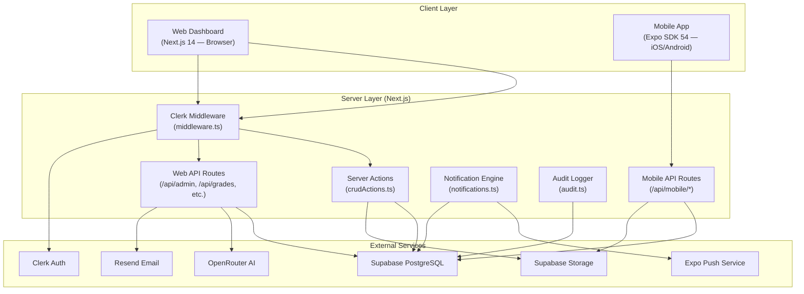

# architecture.md — SnapSchool System Design
> Last updated: 2026-05-27

## High-Level Architecture



---

## Layers & Responsibilities

### 1. Presentation Layer
- **Web:** Next.js App Router pages in `src/app/(dashboard)/` — React Server Components + Client Components
- **Mobile:** React Native screens in `src/screens/` — Client-only, fetches data via REST

**Rule:** UI components handle rendering only. No direct database calls. No business logic.

### 2. Business Logic Layer
- **Server Actions:** `src/lib/crudActions.ts` — All create/update/delete operations for admin dashboard
- **Data Fetching:** `src/lib/data.ts` — Read operations for dashboard pages
- **Notifications:** `src/lib/notifications.ts` — Push + in-app notification creation with deduplication
- **Audit:** `src/lib/audit.ts` — Immutable audit trail

**Rule:** All mutations go through server actions or API routes. Never mutate from a client component directly.

### 3. Data Access Layer
- **Prisma Client:** `src/lib/prisma.ts` — Singleton PrismaClient (Prisma 6, native Rust engine)
- **ORM:** All database access goes through Prisma. No raw SQL.

**Rule:** Always filter by `schoolId` for multi-tenant data isolation. Use `getSchoolId()` for web, `getSchoolIdFromHeader()` for mobile API.

### 4. Auth Layer
- **Web:** Clerk middleware intercepts every non-public route → checks role + status → redirects or allows
- **Mobile:** Custom phone-based auth → `/api/mobile/login` + `/api/mobile/auth` → credentials stored in AsyncStorage

**Rule:** Web and mobile auth are completely separate systems. Never mix Clerk auth into mobile API routes. Mobile routes are public in middleware.

---

## API Contract: Web ↔ Mobile

The mobile app communicates with the Next.js server via REST endpoints under `/api/mobile/`:

| Endpoint                          | Method | Purpose                        |
|-----------------------------------|--------|--------------------------------|
| `/api/mobile/login`               | POST   | Phone number lookup            |
| `/api/mobile/auth`                | POST   | Password setup/signin          |
| `/api/mobile/students`            | GET    | Fetch parent's children        |
| `/api/mobile/home`                | GET    | Student daily schedule + data  |
| `/api/mobile/courses`             | GET    | Student courses list           |
| `/api/mobile/notifications`       | GET/PATCH/DELETE | Notification CRUD     |
| `/api/mobile/announcements`       | GET    | School notices                 |
| `/api/mobile/attendance/history`  | GET    | Attendance records             |
| `/api/mobile/attendance/justify`  | PATCH  | Submit absence justification   |
| `/api/mobile/results`             | GET    | Student exam results           |
| `/api/mobile/upload`              | POST   | File/image upload              |
| `/api/mobile/teacher/*`           | Various| Teacher-specific endpoints     |
| `/api/mobile/tasks/submit`        | GET/POST| Task submission               |
| `/api/mobile/parent`              | GET/PATCH| Parent profile               |
| `/api/mobile/school`              | GET    | School info                    |

**Header contract:** Mobile sends `x-school-id` on every request. Server reads via `getSchoolIdFromHeader()`.

---

## Database Design Decisions

### Multi-Tenancy Strategy
- **Shared database, shared schema** with `schoolId` column on every model
- Fallback to `"default_school"` for backwards compatibility
- `School` model is the root entity — all data hangs off it

### Key Constraints
- `Payment`: `@@unique([studentId, month, year])`, `@@unique([teacherId, month, year])`, `@@unique([staffId, month, year])`
- `Grade`: `@@unique([studentId, subjectId, term])`
- `Attendance`: `@@unique([studentId, date, lessonId])`
- `Class`: `@@unique([name, schoolId])`
- `Level`: `@@unique([level, schoolId])`
- `Subject`: `@@unique([name, schoolId])`

### Indexing Strategy
- All `schoolId` foreign keys are indexed
- High-query fields indexed: `classId`, `parentId`, `levelId`, `teacherId`, `subjectId`, `timestamp`, `date`

---

## State Management

### Web (Server-Side)
- React Server Components fetch data at render time — no client state library needed
- Client Components use React hooks for local UI state
- Server Actions handle mutations with `revalidatePath`

### Mobile (Client-Side)
- **Zustand** for global state (auth, selected student, UI preferences)
- **AsyncStorage** for persistent auth tokens and cached student data
- **In-flight deduplication** via `inflightRequests` Map in `api.ts` to prevent duplicate network calls

---

## Notification Architecture

```
Admin Action (web)
    ↓
Server Action / API Route
    ↓
notifications.ts (create DB record + dedup check)
    ↓
├── prisma.notification.create() → saved to DB
└── expo.sendPushNotificationsAsync() → sent to phone
    ↓
Mobile app receives push → displays in notification center
```

Deduplication windows:
- Payment reminders: 6-hour window
- Attendance alerts: same-day window
- Absence alerts: 6-hour window per count threshold
